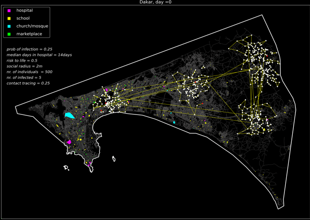
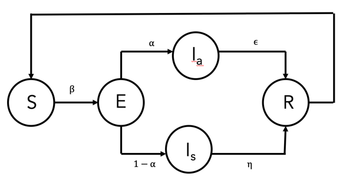
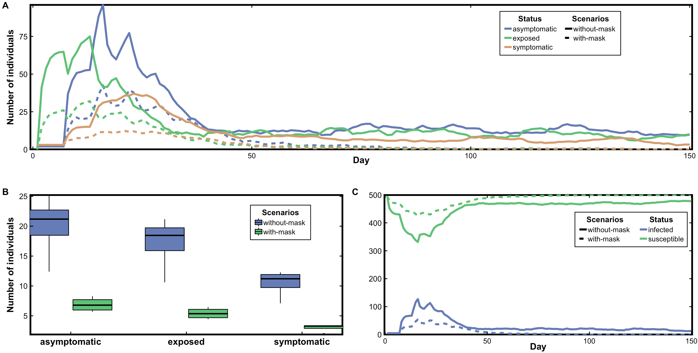

# *Agent-Based Model for Assessing the Impact of Interventions on Covid-19 Pandemic : Dakar, Senegal*

## Purpose 

The model was designed to explore the impact of interventions that aims to control the spread of covid-19. Specifically, we investigate the combined effects of variability to human behavior (regarding risk level) and control measures such as 

* efficiency of contact tracing infected individuals, and capacity of health systems.
* adherence to social distancing, and different levels of lockdown (total and partial).

on the spread of the covid-19 in terms of the number of infections.

<p align="center">
	
	<br>      
	<em>A standard simulation.</em>   
   	</p>
	


<details><summary> Overview </summary><br>

The model has three kinds of entities: individuals, official, and the environment. 

### Environment
* This constitutes the drivable public streets network and paths that pedestrians can use. 
* The street network is a graph that stores the paths as edges and junctions as nodes. 
* The junctions are characterized by their location (x and y coordinates). 
* The street network also has buildings or specific points-of-interest (POIs), i.e. marketplaces.
* The points-of-interest (POIs) are characterized by their location as polygons.

### Individuals
* They are characterized by their location (x and y coordinates).
* Health status: susceptible, exposed, asymptomatic, and symptomatic.
* Risk to life: ones propensity to take risk.
* Social network:  list of other-individuals connected to an individual.
* Social radius: radius within which one interact with others, i.e. social distancing.

### Official  
* They identify infectious individuals for treatmentt at isolation centers. 
* They are characterized by efficiency of contact tracing infected individuals.
* The model time step is a day. The length of one-time step depends on the size of the individuals (minus those at isolation centers). Simulations last for 150 days.

### Social-network 
* The social network follows a small-world social network (Watts and Strogatz, 1998). 
* Small-world network is a graph with many nodes forming cliques (clusters of nodes which are well connected), and fewnodes   that ‘reach across’ to other cliques. 
* It is an important network structure in the study of human systems because it fits many real world networks (both 	physical and social) very well.  
	#### Pseudocode for social network
	```
	1. Each individual connects to its 2-nearest neighbors and then subject to random rewiring. 
	2. In each rewiring event, an individual is randomly selected and drops one of its neighbors randomly. 
	3. It then selects a new  neighbor that is randomly chosen from the general population (excluding those to which it was already connected). 
	```
	
	<p align="center">
	
	<br>      
	<em>An example of small world network.</em>   
   	</p>
  

</details>


<details><summary>. Process and Scheduling</summary><br>

The model includes four sub-models which are executed in the order given below. In each updating, 1 / (8.n) unit length of time passes by, where n is the number of individuals (minus those receiveing treatment at isolation centers) at the time of updating. Therefore, each individual is updated 8 times, on average, in one-unit length of simulated time reflecting the hours of activeness.

 ### Decision-to-move
  * The decision to move (or not-move) is controlled by the parameter _risk-life_. This is a random number from a uniform           distribution between a minimum (0.0) and maximum (1.0).  
  * A decreasing _risk-life_ (i.e. decreasing the maximum) produce a distribution of individuals who are more probable to take       risk (and vice-versa). 

     #### Pseudocode for Decision-to-move
     
     ```python
     
     If random uniform (0.0, 1.0) > average (self risk-life + random neighbor risk-life ) 
                < move >
     else 
              <do not move>
    ```
  * With this setting, individuals with a lower _risk-life_ and having other-individuals with lower risk-life in their social        network are more likely to move (and vice versa).
  * When an individual decides to move, it randomly selects a point-of-interest as its destination.
  * Once the destination has been reached, an individual chooses a new random destination.
  
  
### Moving-to-destination
 * Individuals find the optimal route (in terms of distance) from its current location to the destination using Dijkstra          algorithm (Dijkstra, 1959). 
 * Dijkstra algorithm is used for finding the shortest path from an origin to a destination that minimizes a cost (eg. in        terms of time, distance or financial cost). 
 * Individuals move along the street paths and covers one node in each model iteration of the day. 

     #### Pseudocode for Dijkstra Algorithm
	```python
	
	Let distance of start node from start node be zero.
	Let distance of all other nodes from start node be infinity.
	Repeat
		Visit the unvisited node with the smallest known distance from the start node.
		For the current node, examine its unvisited neighbors.
	  	For the current node, calculate distance of each neighbor from start node.
          	If the calculated distance of a node is less than the known distance, update the shortest distance.
	  	Update the previous node of each of the updated distances.
	  	Add the current node to the list of visited nodes.
	Until all nodes are visited
	```
  


### Interaction-with-others
* Individuals interact with other-individuals within a distance _social-radius_ from itself. 
* The epidemic is represented using the SEIRS (Susceptible - Exposed - Infectious - Recovered - Susceptible). 
  
  <p align="center">
   
   <br>      
      <em>SEIR model</em>   
  </p> 
  
  
     #### Pseudocode for Interaction and progression of disease
	
	 ```
	 
	1. If an infectious (i.e. symptomatic or asymptomatic) individual is located within the social-radius, a susceptible
	individual becomes exposed with probability prob-exposed, i.e. the individual is infected but not infectious. 
	
	2. After an incubation duration of incubation-period days, an exposed individual transition to infectious and becomes
	asymptomatic with probability prob-infection, else symptomatic. 
	
	3. Asymptomatic individuals recover and becomes susceptible again (i.e. recovery does not confer lifelong immunity
	after asymptomatic-recovery days. The recovered individual remains immune for recovery-susceptible days before becomes susceptible.

	```

 
 ### Quaranining-by-officials
 * Infectious individuals are removed from the general population with probability _efficiency-contact-tracing_ to the isolation centers for treatment. 
 * After _recovery-symptomatic_ days at the isolation centers, they either recover (and returned to the general population) or die. 
 * The probability of recovery is of symtomatic individuals is dependent on the number of individuals being treated at the hospital, i.e. recovery becomes less likely as the number of individuals at the hospitals increases. 
 * This setting reflects that the health-care quality becomes poorer as the health system becomes over-capacited.

      #### Pseudocode of contact tracing to treatment at hospital
      
 	```python
	
	If infectious and symptomatic and random (0,1) < efficiency-contact-tracing
		If random (0,1) < 1 – (nr. of individuals at hospital / carrying capacity of hospital)
			recover and returned to the general population
		else
			after 14 days, immunity dies-out and becomes susceptible 

	```
</details>


<details><summary> Initialization and Parameters </summary><br>

The model is initialized with a number of susceptible and infectious (symptomatic and symptomatic) individuals. The other parameters initialized for individuals includes, _prob-exposed_, _incubation-period-exposed_, _prob-infection_, _days-recovery-asymptomatic_, _recovery-period_, _risk-life_, _social-radius_ ,_days-recovery-symptomatic_, activeness-per-day, and hospital-capacity. The official is initialized with _efficiency-contact-tracing_. 

```python

num_agents = 500  # number of agents 
num_citizens_infected = 5 # number of infectious agents (half-symptomatic and half-asymptomatic) 

prob_exposed = 0.3 # probability of a susceptible becoming exposed (but not yet infectious upoun contact)
incubation_period = 5  # days required to transition from exposed to infectious
prob_infection = 0.8 # probability of an exposed transitioning to infectious (asymptomatic) else symptomatic
recovery_susceptible = 14 # days to remain immune upon recovery 
asymptomatic_recovery = 9 # days to transition from asymptomatic to recovered
quarantined_recovery = 14 # days to clinical recovery 
num_years = 150 # number of years of simulation

risk_life = 0.5 #  risk level by moving outside
social_radius = 2 # social radius within which interaction is possible
eff_quarantined = 0.25 # efficiency of contact tracing symptomatic for treatments at hospitals
hospital_capacity = 0.5 # the capacity of the hospitals (in reference to the general population)
essentials_move = 8 # move out only for essentials

```

</details>


	

<details><summary> References </summary><br>
	
Watts, D.J. and Strogatz, S.H. [Collective dynamics of ‘small-world’networks](https://www.nature.com/articles/30918). *nature*, **393**(6684), p.440, 1998.

Dijkstra, E.W. [A note on two problems in connexion with graphs](https://link.springer.com/article/10.1007/BF01386390). *Numerische mathematik*, **1**(1), pp.269-271, 1959.

Boeing, G. [Urban Street Network Analysis in a Computational Notebook](https://escholarship.org/uc/item/6z9802kf), 2020.

Crooks, A. and Hailegiorgis, A. [Disease modeling within refugee camps: A multi-agent systems approach](https://ieeexplore.ieee.org/document/6721551)., *Winter Simulations Conference (WSC)*, pp. 1697-1706, EEE, 2013.

</details>


## Model outputs of different simulation scenarios
	
<!--  

<p float="left">
   <em> Hospitals, schools, markets, churches / mosques opened     
	          &nbsp; &nbsp; &nbsp; &nbsp; &nbsp; 
    Hospitals, schools, churches / mosque closed excepts  markets    </em>  
 <br>     
   
    
 	
</p>  

-->

### 
<p align="center">
   
   <br>      
      <em>Temporal dynamics of infections (A and C) resulting from different different scenarios, namely with-mask and  without-mask. Each line (A and C) is an average of four replicate simulations.  The boxplots  (B) show the variability of the four replicates for infections.   
/em>   
</p>
  


## Working Team

Prof. Mouhamed Moustapha Fall \
President of the [African Institute for Mathematical Sciences](https://www.aims-senegal.org/) (AIMS-Senegal) \
Humboldt Endowed Chair in Mathematics and its Applications at  AIMS-Senegal \
AIMS-Senegal  KM 2, Route de Joal  B.P. 14 18 Mbour, Senegal     
mouhamed.m.fall@aims-senegal.org 

Dr. Kwabena Afriyie, Owusu \
African Institute for Mathematical Sciences \
AIMS-Senegal  KM 2, Route de Joal  B.P. 14 18 Mbour, Senegal         
kwabena@aims.edu.gh 
