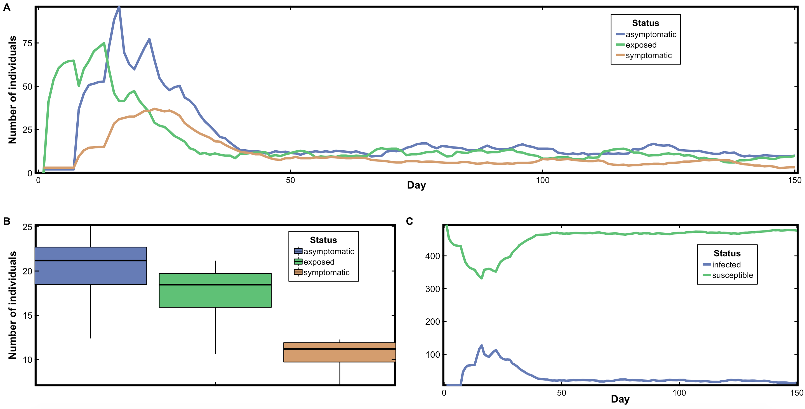

# *An agent-based model for assessing impact of  non-pharmaceutical interventions on COVID-19 pandemic*

## Purpose 

Our model was designed to explore the efficacy of non-pharmaceutical interventions in mitigating the COVID-19 infection. Specifically, we examine ways in which interaction is impacted by different social distancing measures (such as social radius, lock-down, and contact tracing, wearing face mask)  as well as the capacity of the health systems in light of variability in public trust (and consequent compliance) in policymakers. The model consist of three key components : 
* a street network of the area of interest (environment),
* agents who move along the street networks according to Dijkstra algorithm, and  
* SEIRS  (Susceptible - Exposed - Infectious - Recovered - Susceptible) disease model. 

<p align="center">
	
	<br>      
	<em>A standard simulation.</em>   
   	</p>
	


<details><summary> Overview </summary><br>

We used the Python module called \href{https://github.com/gboeing/osmnx}{OSMnx} to retrieve the street network and specific points-of-interest (POIs) for Dakar region from OpenStreetMap (a global crowd-sourced world map), and constructed a graph model of it via the python package \href{https://networkx.github.io/documentation/stable/}{NetworkX}. The street network consists of all the walkable and drivable paths, storing the paths as edges and junctions as nodes (\autoref{fig:env}). The points-of-interest (POIs) includes  34 hospitals, 379 schools, 73 marketplaces, and 728 place-of-worship. We represented the three-dimensional map of Dakar region on a flat, two-dimensional map, by projecting it to the coordinate reference system WGS 84 / Pseudo-Mercata (Units: meters - Easting / Northing).

### Social-network 
* The social network follows a small-world social network (Watts and Strogatz, 1998). 
* Small-world network is a graph with many nodes forming cliques (clusters of nodes which are well connected), and fewnodes   that ‘reach across’ to other cliques. 
* It is an important network structure in the study of human systems because it fits many real world networks (both 	physical and social) very well.  
	#### Pseudocode for social network
	```
	1. Each individual connects to its 2-nearest neighbors and then subject to random rewiring. 
	2. In each rewiring event, an individual is randomly selected and drops one of its neighbors randomly. 
	3. It then selects a new  neighbor that is randomly chosen from the general population (excluding those to which it was already connected). 
	```
	
	<p align="center">
	
	<br>      
	<em>An example of small world network.</em>   
   	</p>
  

</details>


<details><summary>. Process and Scheduling</summary><br>

The model includes four sub-models which are executed in the order given below. 

 ### Decision-to-move
 
The agent's decision to move (or not-to move) is motivated by their individual difference regarding trust (and consequently compliance) in policymakers. The trust level of an agent is a random number drawn between a minimum of 0.0 and a maximum _max. trust_. Increasing (or decreasing) the maximum produces a more probable distribution of agents with high trust in policymakers and compliance to reducing movements only to essential service.
 
   #### Pseudocode for Decision-to-move
     
  ```python
     
     If random uniform (0.0, _max. trust_ ) > average (self trust + random neighbor trust ) 
                < move around >
     else 
              <do not move>
 ```
 With this setting, individuals with a lower trust and having other-individuals with lower trust in their social network are more likely to move (and vice versa). When an individual decides to move, it randomly selects a point-of-interest as its destination. Once the destination has been reached, an individual chooses a new random destination.
  
  
### Moving-to-destination
 The agents move along the street network using the optimal route to their destination as determined by the Dijkstra  algorithm. Dijkstra’s algorithm finds the shortest path from any one node in the street network to every other node within the same street network that minimizes a cost (here distance). We run Dijkstra’s algorithm just once and save the results. We then look up our results without having to actually run the algorithm itself anytime the shortest path between any two nodes is required.  
     
   #### Pseudocode for Dijkstra Algorithm
```python
	
	Let distance of start node from start node be zero.
	Let distance of all other nodes from start node be infinity.
	Repeat
		Visit the unvisited node with the smallest known distance from the start node.
		For the current node, examine its unvisited neighbors.
	  	For the current node, calculate distance of each neighbor from start node.
          	If the calculated distance of a node is less than the known distance, update the shortest distance.
	  	Update the previous node of each of the updated distances.
	  	Add the current node to the list of visited nodes.
	Until all nodes are visited
	
```
  


### SEIRS disease model

An agent interacts with other agents within a given social radius. The spread of the disease is represented using the SEIRS (Susceptible - Exposed - Infectious - Recovered - Susceptible) model. The probability of an agent wearing a face mask is a random number between a minimum of 0.0 and a maximum _max. mask_. Increasing (or decreasing) the maximum produces a distribution of agents who are more probable to wear a face mask (not wear a face mask).
 
  <p align="center">
   
   <br>      
      <em>SEIR model</em>   
  </p> 
  
  
  #### Pseudocode for Interaction and progression of disease
	
We implemented SEIRS in our model as follows: If  (i) at least one infectious agent (i.e. symptomatic or asymptomatic) is within the social radius, (ii) a random number drawn from a uniform distribution is less than the probability of becoming exposed, and (iii) a random number drawn between 0 and _max. mask_ is greater than an agent's probability of wearing a face mask, then the agent becomes exposed if susceptible.  After an incubation period of 5 days , an exposed agent transition to infectious state and becomes either asymptomatic with probability of 0.8, else symptomatic. The asymptomatic agents recover after 9 days. A recovered agent remains immune for 14 days (recovery does not confer a lifelong immunity) before becoming susceptible again.	


 ### Isolating for treatment
 
Infectious agents (i.e. symptomatic and asymptomatic) are contact traced with given efficiency, isolated from the general population to treatment center where they can no longer infect others. The symptomatic agent has the tendency to recover after 14 days at the treatment center and their recovery delays as the treatment center become overwhelmed (i.e. stretched beyond its capacity).      

#### Pseudocode of contact tracing to treatment at hospital
      
 ```python
	
	If symptomatic, spent more than 14 days under treatment and random (0,1) < efficiency-contact-tracing
		If random (0,1) < 1 – (nr. of infectious at treatment center / carrying capacity of treatment center)
			recovery occurs and returned to the general population, 
			remain immune for an additional 14 days before becoming susceptible again.		
		else
			recovery does not occur and still kept at the treatment center
	
```
	
</details>


<details><summary> Initialization, handling of events and parameters </summary><br>
	
The model time step represents a day. The length of a one-time step depends on the number of agents in the general population.  In each day updating, a (1 / 8 * n) unit length of time passes by, where n is the number of agents in the general population at the time of updating. Therefore, each agent is updated 8 times, on average, in the one-unit length of the simulated day reflecting the hours per day that an agent can interact with others. Simulations last for 150 days.

	
<p align="center">
   
   <br>      
      <em>  Flow diagram illustrating the events handled by the agent-based model over a day. The oval, diamonds, and rectangles mark, respectively, the initialization, the decision, and the action occurring during the simulations. The arrow shows the direction of the events.     </em>   
</p>


```python

num_agents = 500  # number of agents 
num_citizens_infected = 5 # number of infectious agents (half-symptomatic and half-asymptomatic) 

prob_exposed = 0.3 # probability of a susceptible becoming exposed (but not yet infectious upoun contact)
incubation_period = 5  # days required to transition from exposed to infectious
prob_infection = 0.8 # probability of an exposed transitioning to asymptomatic  (else symptomatic)
recovery_susceptible = 14 # days to remain immune upon recovery 
asymptomatic_recovery = 9 # days to transition from asymptomatic to recovered
quarantined_recovery = 14 # minimum days to clinical recovery for symptomatic
num_years = 150 # number of years of simulation

max. trust = 0.5 #  maximum distribution level of trust in policymakers
max. mask = 0.0 #   maximum distribution level of wearing face mask
social_radius = 2 # social radius within which interaction is possible
eff_quarantined = 0.25 # efficiency of contact tracing for isolaion to treatment center
treatment_capacity = 0.5 * num_agents # the capacity of the health system 
level_lockdown = 8 # hours allowed outside

```

</details>


	

<details><summary> References </summary><br>
	
Watts, D.J. and Strogatz, S.H. [Collective dynamics of ‘small-world’networks](https://www.nature.com/articles/30918). *nature*, **393**(6684), p.440, 1998.

Dijkstra, E.W. [A note on two problems in connexion with graphs](https://link.springer.com/article/10.1007/BF01386390). *Numerische mathematik*, **1**(1), pp.269-271, 1959.

Boeing, G. [Urban Street Network Analysis in a Computational Notebook](https://escholarship.org/uc/item/6z9802kf), 2020.

Crooks, A. and Hailegiorgis, A. [Disease modeling within refugee camps: A multi-agent systems approach](https://ieeexplore.ieee.org/document/6721551)., *Winter Simulations Conference (WSC)*, pp. 1697-1706, EEE, 2013.

</details>


## Model outputs for different interventions
	
<!--  

<p float="left">
   <em> Hospitals, schools, markets, churches / mosques opened     
	          &nbsp; &nbsp; &nbsp; &nbsp; &nbsp; 
    Hospitals, schools, churches / mosque closed excepts  markets    </em>  
 <br>     
   
    
 	
</p>  

-->

### 
<p align="center">
   
   <br>      
      <em>   Temporal dynamics of (A) exposed, asymptomatic and symptomatic  (C) infectious (i.e. asymptomatic plus symptomatic), resulting from simulations using the standard parameter values. Each line (A and C) is an average of four replicate simulations. The boxplots B, show the variability of the four replicates.       </em>   
</p>
  

<p align="center">
   
   <br>      
      <em> Temporal dynamics of exposed, asymptomatic and symptomatic from simulations using (A) 50\% increase in the standard value of agents trust in policymakers (B) 50\% increase in the standard value of agents tendency to wear a face mask. Each line (A and B) is an average of four replicate simulations. The boxplots C, show the variability of the four replicates. The height of the  barplots D, indicates deviations from the results obtained with standard parameter values./em>   
</p>


<p align="center">
   
   <br>      
      <em> Temporal dynamics of  infectious agents (i.e. symptomatic plus asymptomatic) under different social distancing interventions. Each line is an average of four replicate simulations./em>   
</p>


<p align="center">
   
   <br>      
      <em>Sensitivity of infections under different social distancing interventions. The height of the bars indicates deviations from the results obtained with standard parameter values. Each bar is an average of four replicate simulations./em>   
</p>


## Working Team

Prof. Mouhamed Moustapha Fall \
President of the [African Institute for Mathematical Sciences](https://www.aims-senegal.org/) (AIMS-Senegal) \
Humboldt Endowed Chair in Mathematics and its Applications at  AIMS-Senegal \
AIMS-Senegal  KM 2, Route de Joal  B.P. 14 18 Mbour, Senegal     
mouhamed.m.fall@aims-senegal.org 

Dr. Kwabena Afriyie, Owusu \
African Institute for Mathematical Sciences \
AIMS-Senegal  KM 2, Route de Joal  B.P. 14 18 Mbour, Senegal         
kwabena@aims.edu.gh 
